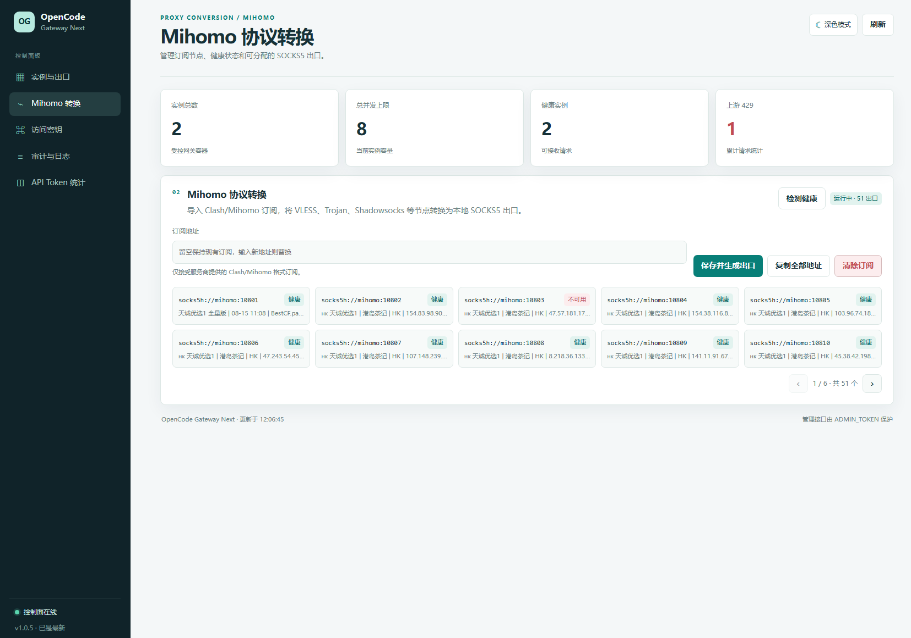
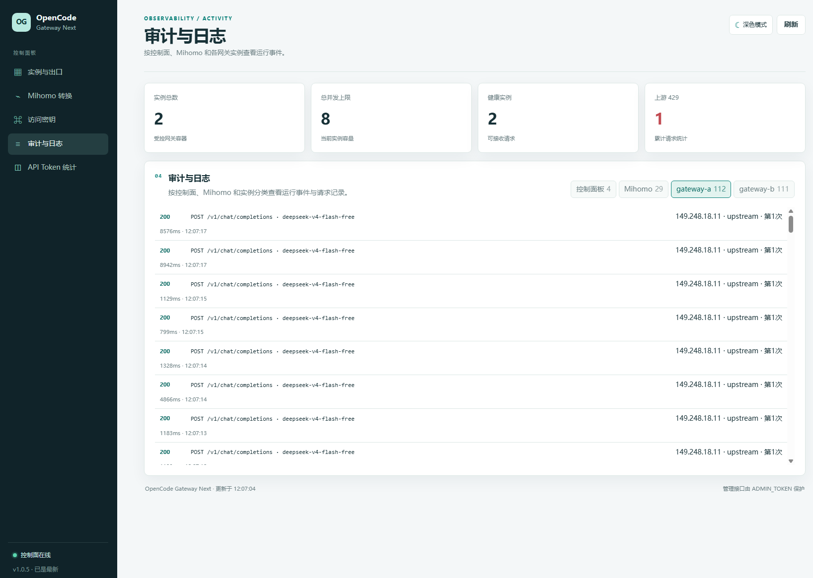
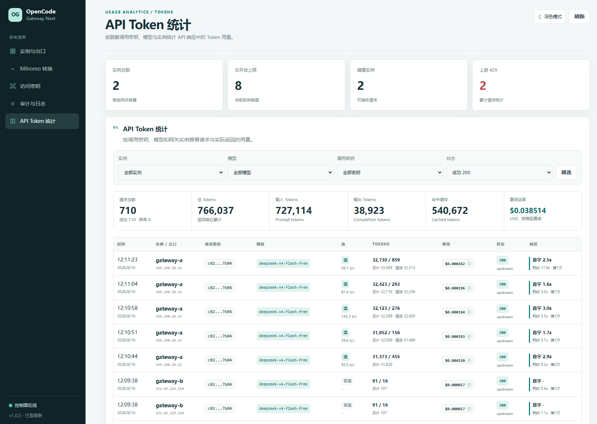

# OpenCode Gateway Next

一个可自托管的 OpenCode Zen API 网关。控制台统一管理动态实例、Zen API Key、代理出口、Mihomo 订阅与请求审计；客户端只需访问一个 OpenAI 兼容 API 地址。

当前版本：**1.0.10**

> 上游可用性、额度与限流由 OpenCode 决定。增加实例或出口不等于增加上游账户额度。

## 功能概览

- 统一提供 `/v1/*` API，兼容 `/openai/v1/*`、`/anthropic/v1/*`、`/codex/v1/*`。
- 控制台创建、设置、启动、停止、重启和删除网关实例。
- 每个实例独立设置 Zen API Key、并发、队列与 HTTP/HTTPS/SOCKS5 出口。
- 导入 Clash/Mihomo 订阅，将 VLESS、Trojan、Shadowsocks、VMess、Hysteria2 等节点转换为本地 SOCKS5 端口。
- 实例固定使用当前健康出口；仅在 429、连接故障、出口冲突或手动换线时切换。
- 审计、日志和 Token 统计覆盖所有已转发接口路径（包括 `/v1/chat/completions`、`/v1/responses` 和模型查询），可按接口、实例、模型、脱敏调用密钥及流式状态筛选；支持首字耗时、Token 速度和 USD 费用展示。
- 实例启动后通过 `/healthz` 预检，只有健康实例进入统一 API 流量池。

### 控制台展示








## 快速部署

需要 Docker Engine 或 Docker Desktop 与 Docker Compose v2。Linux 主机还需让控制面访问 `/var/run/docker.sock`。

```bash
cp config.example.env .env
openssl rand -hex 32
docker compose up -d --build
docker compose ps
```

将生成的随机值分别写入 `.env`：

```env
GATEWAY_KEYS=replace-with-client-key
ADMIN_TOKEN=replace-with-admin-token
INSTANCE_ADMIN_TOKEN=replace-with-instance-token
```

三个 Token 应使用不同随机值。默认端口如下：

| 用途 | 地址 |
|---|---|
| 控制台 | `http://127.0.0.1:13338/` |
| API | `http://127.0.0.1:13337/v1` |
| 实例内部端口 | `13339`，无需对外暴露 |

首次启动没有实例是正常状态。打开控制台，输入 `ADMIN_TOKEN` 后创建第一个实例：选择 `Bearer public` 或填写自己的 Zen API Key，再设置并发、队列和候选出口。实例显示“在线”和“流量池”后即可调用。

## API 调用

```bash
curl --no-buffer http://127.0.0.1:13337/v1/chat/completions \
  -H "Authorization: Bearer $GATEWAY_KEY" \
  -H "Content-Type: application/json" \
  -d '{
    "model": "deepseek-v4-flash-free",
    "messages": [{"role": "user", "content": "hello"}],
    "stream": true
  }'
```

客户端 Key 只用于访问网关；每个实例保存的 Zen API Key 才用于访问上游。网关会固定上游请求头：

```text
User-Agent: opencode/1.18.16
HTTP-Referer: https://opencode.ai/
X-Title: opencode
X-OpenCode-Client: cli
```

## Mihomo 与出口

在“Mihomo 协议转换”中保存服务商提供的 Clash/Mihomo HTTP(S) 订阅，然后点击“检测健康”。新建或设置实例时，选择带绿点的本地端口，例如：

```text
socks5h://mihomo:10801
socks5h://mihomo:10802
```

`vless://`、`trojan://`、`ss://` 分享链接和 Cloudflare `IP:443` 不是实例代理地址，需先由 Mihomo 或其他客户端转换为 HTTP/SOCKS5 服务。

普通请求会保持当前出口。上游 429 会按“实例 + 模型 + 出口”冷却并在健康候选中有限切换；网络错误、响应截断和重复公网出口也会触发换线。已向客户端输出内容的流式响应不会中途重试，以免重复或拼接回复。

## 常用配置

| 变量 | 默认值 | 作用 |
|---|---:|---|
| `GATEWAY_KEYS` | 必填 | 客户端统一 API Key，多个值用逗号分隔 |
| `ADMIN_TOKEN` | 必填 | 控制台管理 Token |
| `INSTANCE_ADMIN_TOKEN` | `ADMIN_TOKEN` | 控制面访问实例内部管理接口的 Token |
| `API_HOST_PORT` | `13337` | API 宿主机端口 |
| `CONTROL_HOST_PORT` | `13338` | 控制台宿主机端口 |
| `MAX_INSTANCES` | `16` | 实例数量上限 |
| `MIHOMO_MAX_SLOTS` | `64` | Mihomo SOCKS5 槽位上限，最大 `128` |
| `DIRECT_FALLBACK` | `false` | 存在代理实例时是否让直连实例参与分流 |
| `OPENCODE_CLIENT` | `cli` | 上游 `X-OpenCode-Client` |
| `DISABLE_THINKING_BY_DEFAULT` | `true` | DeepSeek V4 Flash 未明确指定思考模式时关闭推理，避免输出预算耗尽后正文为空 |
| `MIN_THINKING_MAX_TOKENS` | `8192` | 显式开启推理时，将较小的总输出预算提升到该值；设为 `0` 关闭保护 |

完整变量说明见 [config.example.env](./config.example.env)。

DeepSeek V4 Flash 默认关闭推理时，网关会同时发送 `thinking: {"type":"disabled"}` 与真正生效的 `reasoning_effort: "none"`。旧客户端只发送 `thinking.disabled` 时，网关也会自动补齐 `reasoning_effort=none`；客户端明确发送 `reasoning_effort=low/high/none` 或 `thinking.enabled` 时保持原值。显式开启推理但预算低于 `MIN_THINKING_MAX_TOKENS` 时，网关会提升 `max_tokens`、`max_completion_tokens` 或 `max_output_tokens`，为正文留出更大概率空间。该参数仍是推理与正文共享的总预算，并非独立 reasoning 上限。AI SDK/OpenCode 配置使用 camelCase 的 `reasoningEffort`，实际 HTTP 字段为 snake_case 的 `reasoning_effort`。

## 单域名反代

宿主机 Nginx 按路径分流：

```text
/v1/、/openai/、/anthropic/、/codex/  -> 127.0.0.1:13337
/、/api/、/static/                    -> 127.0.0.1:13338
```

客户端访问 `https://gateway.example.com/v1/chat/completions`。不要直接反代单个实例的 `13339`，否则会绕过统一鉴权、调度与审计。示例见 [host-single-domain.conf.example](./nginx/host-single-domain.conf.example)。

## 升级与排错

```bash
docker compose up -d --build --force-recreate control-plane mihomo
docker compose logs --tail=100 control-plane
docker compose logs --tail=100 mihomo
docker ps -a --filter label=opencode.gateway.managed=true
```

控制面升级后，动态实例不会自动替换。逐个打开实例设置并保存，即可使用新网关镜像。

| 现象 | 优先检查 |
|---|---|
| 创建实例返回 `502` | Docker Socket、镜像、Mihomo 健康节点、实例日志 |
| 模型返回 `429` | 审计中的 `upstream429`、模型冷却、Zen Key 与上游额度 |
| `gateway_overloaded` | 实例并发、队列容量、当前请求量 |
| `unexpected EOF` | 当前出口或节点提前断开；网关会冷却并在可安全重试时切换候选出口 |
| 返回 `content` 为空但 `reasoning` 已达到上限 | 推理与正文共用 `max_tokens`；关闭推理时明确传入 `reasoning_effort: "none"`，仅传 `thinking.disabled` 的旧请求会由网关自动兼容 |
| 长请求约 125 秒后返回 Cloudflare `524` | Cloudflare 代理读取超时先于模型完成；缩短任务、关闭推理、拆分请求，或让 API 域名绕过 Cloudflare 代理 |
| 控制台样式旧 | 重建控制面容器并清理 Nginx/CDN 静态缓存 |

控制台会检查 [choateyang/OpenCode-Gateway-Next](https://github.com/choateyang/OpenCode-Gateway-Next) 的 Release 或 Tag；更新检查失败不影响 API 服务。

## 安全

Docker Socket 具有宿主机管理权限，只应向可信管理员开放控制台。生产环境应配置 TLS、管理员认证、IP 白名单和外部限流。不要提交或公开 `.env`、`data/`、订阅地址、Zen API Key、客户端 Key 与管理员 Token。

## 致谢

感谢以下项目在接口兼容、代理出口和控制台架构调研中提供的参考：

- [spfnas/opencode2api-free](https://github.com/spfnas/opencode2api-free)
- [GuJi08233/opencode-free-gate](https://github.com/GuJi08233/opencode-free-gate)
- [ouqiting/ds2api](https://github.com/ouqiting/ds2api)
- [cmliu/edgetunnel](https://github.com/cmliu/edgetunnel)

使用这些项目或其衍生代码时，请遵守各自许可证与服务条款。
