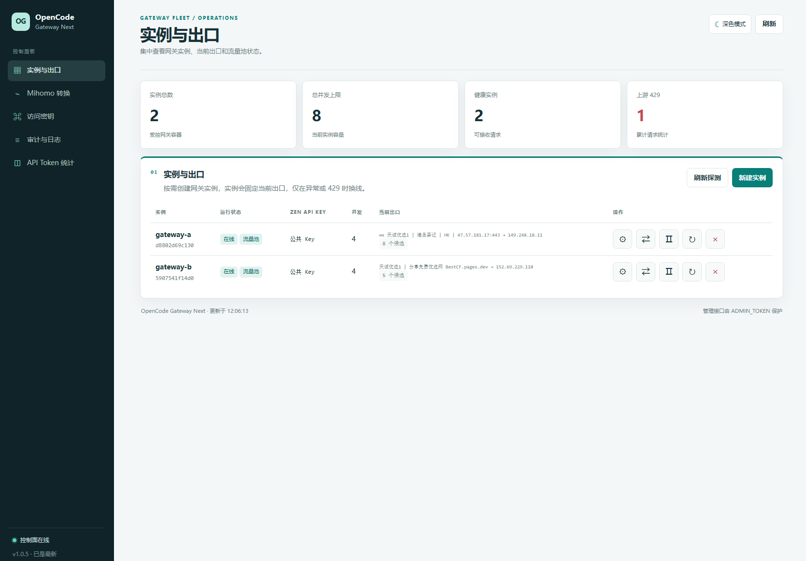

# OpenCode Gateway Next

OpenCode Gateway Next 是一个可自托管的 OpenCode API 网关。它将多个动态网关实例、Zen API Key、代理出口、Mihomo 节点和请求审计集中到一个控制台管理，并向客户端提供统一的 OpenAI 兼容 API。

当前版本：**1.0.4**

> 本项目面向技术研究和个人自托管场景。上游模型、额度、速率限制和账户规则以 OpenCode 官方说明为准。增加实例或出口不等于增加上游账户额度。

## 功能概览

- 提供统一的 `/v1/*` API 入口，并兼容 `/openai/v1/*`、`/anthropic/v1/*` 和 `/codex/v1/*`。
- 从控制台创建、设置、启动、停止、重启和删除网关实例。
- 每个实例独立设置 Zen API Key、并发上限、队列容量和候选代理。
- 支持 HTTP、HTTPS、SOCKS5 和 SOCKS5H 出口。
- 支持导入 Clash/Mihomo 订阅，将 VLESS、Trojan、Shadowsocks、VMess、Hysteria2 等节点转换为本地 SOCKS5 端口。
- 启动后异步检测代理健康状态和真实公网出口 IP。
- 普通请求固定使用当前出口；只有发生 429、连接故障、出口重复或手动换线时才切换。
- 按控制面、Mihomo 和各网关实例分类展示系统日志与请求审计。
- 提供独立的 API Token 统计页，按脱敏调用密钥、模型、实例、状态和流式模式汇总输入、输出与缓存 Token，并显示首字耗时、流式 Token 速度和 USD 费用明细。
- 新启动或重启的实例会先通过 `/healthz` 预检，再加入 API 流量池，避免首次请求被尚未就绪的容器接收。
- 控制台按 `/instances`、`/mihomo`、`/keys`、`/logs` 和 `/tokens` 分离工作区，便于日常运维。
- 提供浅色、深色主题，并在控制台检查 GitHub 最新版本。



## 工作方式

```text
浏览器
  └─> control-plane :13338
      控制台、实例管理、Mihomo 管理、日志与审计

API 客户端
  └─> control-plane :13337
      统一鉴权与实例负载均衡
        ├─> gateway-a :13339 ─> 直连或代理出口
        ├─> gateway-b :13339 ─> Mihomo SOCKS5
        └─> gateway-c :13339 ─> Mihomo SOCKS5

Mihomo
  └─> 10801、10802、10803 ...
```

默认 Compose 只管理 `control-plane` 和 `mihomo` 两个容器。控制台创建的 `gateway-*` 是通过 Docker API 动态创建的，因此不会作为 Compose service 出现在 `docker compose ps` 中。

## 快速开始

### 环境要求

- Docker Engine 或 Docker Desktop
- Docker Compose v2
- Linux 部署时允许控制面访问 `/var/run/docker.sock`

### 1. 创建配置

```bash
cp config.example.env .env
```

生成客户端网关 Key：

```bash
openssl rand -hex 32
```

将生成结果写入 `.env`：

```env
GATEWAY_KEYS=replace-with-client-key
ADMIN_TOKEN=replace-with-admin-token
INSTANCE_ADMIN_TOKEN=replace-with-instance-token
GATEWAY_IMAGE=opencode-gateway-next-gateway:latest
MAX_INSTANCES=16
```

`GATEWAY_KEYS`、`ADMIN_TOKEN` 和 `INSTANCE_ADMIN_TOKEN` 应使用三个不同的随机值。多个客户端 Key 使用英文逗号分隔。

### 2. 启动服务

```bash
docker compose up -d --build
docker compose ps
```

默认端口：

| 用途 | 地址 | 说明 |
|---|---|---|
| 控制台 | `http://127.0.0.1:13338/` | 使用 `ADMIN_TOKEN` 登录 |
| API | `http://127.0.0.1:13337/v1` | 使用 `GATEWAY_KEYS` 鉴权 |
| 实例内部端口 | `13339` | 不应直接暴露或反代 |

需要修改宿主机端口时，在 `.env` 中设置：

```env
CONTROL_HOST_PORT=13338
API_HOST_PORT=13337
```

### 3. 创建第一个实例

初次启动时没有网关实例，这是预期行为：

1. 打开控制台并输入 `ADMIN_TOKEN`。
2. 点击“新建实例”。
3. 选择 `Bearer public` 或填写自己的 OpenCode Zen API Key。
4. 设置并发上限和队列容量。
5. 代理可留空直连，也可以填写 HTTP、HTTPS、SOCKS5 地址。
6. 创建成功后，在实例列表确认状态为“在线”和“流量池”。

没有可用实例时，API 返回：

```text
503 no_gateway_instances
```

## 配置说明

常用环境变量：

| 变量 | 默认值 | 作用 |
|---|---:|---|
| `GATEWAY_KEYS` | 无 | 客户端访问统一 API 的 Key |
| `ADMIN_TOKEN` | 无 | 控制台管理 Token |
| `INSTANCE_ADMIN_TOKEN` | `ADMIN_TOKEN` | 控制面访问实例管理 API 的内部 Token |
| `API_HOST_PORT` | `13337` | 宿主机 API 端口 |
| `CONTROL_HOST_PORT` | `13338` | 宿主机控制台端口 |
| `MAX_INSTANCES` | `16` | 可创建实例数量上限 |
| `MIHOMO_MAX_SLOTS` | `64` | Mihomo 最大出口槽位数，硬上限 128 |
| `DIRECT_FALLBACK` | `false` | 代理实例存在时是否仍允许直连实例参与分流 |
| `GATEWAY_IMAGE` | 项目镜像 | 动态实例使用的固定镜像 |
| `OPENCODE_VERSION` | `1.18.16` | 上游 `User-Agent` 中的版本号 |
| `OPENCODE_REFERER` | `https://opencode.ai/` | 上游 `HTTP-Referer` |
| `OPENCODE_TITLE` | `opencode` | 上游 `X-Title` |

完整示例请查看 [config.example.env](./config.example.env)。

## Mihomo 代理出口

控制台可以导入服务商提供的 Clash/Mihomo HTTP(S) 订阅。订阅中的节点由 Mihomo 转换为：

```text
socks5h://mihomo:10801
socks5h://mihomo:10802
socks5h://mihomo:10803
```

使用流程：

1. 在“Mihomo 协议转换”中填写订阅地址并保存。
2. 等待状态显示“运行中”。
3. 点击“检测健康”。
4. 在新建或设置实例时勾选带绿点的出口。
5. 保存后观察实例当前节点和真实出口 IP。

Mihomo 面板每页显示 10 个端口。不可用节点以红色标记，不会参与请求或 429 换线。

以下内容不能直接作为实例代理地址：

- `vless://`、`trojan://`、`ss://` 等分享链接。
- Cloudflare 优选 `IP:443`。
- 普通 Base64 分享订阅或网页登录地址。

它们必须先由 Mihomo、sing-box 或其他客户端转换为 HTTP/SOCKS5 代理端口。

## 出口切换与 429

每个实例会固定一个当前健康出口，普通请求不会在所有代理之间轮询。以下情况才会触发切换：

- 上游返回 429。
- 代理连接失败或超时。
- 多个实例占用了相同公网出口 IP。
- 管理员点击实例的换线按钮。

429 冷却按“实例 + 模型 + 出口”记录。某个模型在一个出口进入冷却，不会自动切换模型，也不会无限重试。网关只在健康候选中执行有限次数的重试。

控制面还会对实例级故障执行短时熔断：实例返回 `5xx`、转发连接错误或响应体截断后，统一 API 会在 15 秒内跳过该实例；连续失败按指数延长，最长 2 分钟。完整响应传输结束后自动恢复。这样多实例同时运行时，单个出口抖动不会持续影响其他健康实例。

控制台中的计数含义：

| 指标 | 含义 |
|---|---|
| `gateway429` | 网关自身并发或队列已满 |
| `upstream429` | OpenCode 或模型提供方返回限流 |
| `errors` | 网络错误、5xx 或其他转发失败 |
| `success` | 成功完成的上游请求 |

## API 调用

非流式请求：

```bash
curl http://127.0.0.1:13337/v1/chat/completions \
  -H "Authorization: Bearer $GATEWAY_KEY" \
  -H "Content-Type: application/json" \
  -d '{
    "model": "deepseek-v4-flash-free",
    "messages": [{"role": "user", "content": "hello"}],
    "stream": false
  }'
```

流式请求：

```bash
curl --no-buffer http://127.0.0.1:13337/v1/chat/completions \
  -H "Authorization: Bearer $GATEWAY_KEY" \
  -H "Content-Type: application/json" \
  -d '{
    "model": "deepseek-v4-flash-free",
    "messages": [{"role": "user", "content": "hello"}],
    "stream": true
  }'
```

网关向 OpenCode Zen 转发时会覆盖客户端传入的上游鉴权和客户端标识，并发送 Zen CPA 所需的请求头：

```text
User-Agent: opencode/1.18.16
HTTP-Referer: https://opencode.ai/
X-Title: opencode
X-OpenCode-Client: cli
```

其中前三项可以通过 `OPENCODE_VERSION`、`OPENCODE_REFERER` 和 `OPENCODE_TITLE` 调整。客户端的 `Authorization` 只用于访问网关，实例自己的 Zen API Key 才用于访问上游。

## 单域名反代

宿主机 Nginx 应按路径分流：

```text
/v1/、/openai/、/anthropic/、/codex/  -> 127.0.0.1:13337
/、/api/、/static/                    -> 127.0.0.1:13338
```

业务客户端使用：

```text
https://gateway.example.com/v1/chat/completions
```

不要直接反代某个实例的 `13339`，否则会绕过统一鉴权、动态负载均衡、出口协调和请求审计。可参考 [nginx/host-single-domain.conf.example](./nginx/host-single-domain.conf.example)。

若控制台 HTML 已更新但样式仍是旧版，请确认 `/static/style.css?v=1.0.0` 返回新版文件，并清除 Nginx 或 CDN 的静态资源缓存。

## 并发测试

以下数据来自特定测试环境，只用于观察网关容量调整前后的变化，不代表 OpenCode 上游的固定限制。结果会受 VPS 网络、出口 IP、Zen API Key、模型、提示词长度和上游状态影响。

### 初始配置

| 并发 | 成功率 | 平均延迟 | 现象 |
|---:|---:|---:|---|
| 5 | 100% | 4.3 s | 稳定 |
| 10 | 100% → 24% | 12.8 s | 波动较大 |
| 20 | 10%，加入重试后 69% | 13.5 s | 大量 `429 gateway_overloaded` |
| 30 | 40% | 9.2 s | 网关排队和限流为主 |

初始配置下，P50 延迟约为 9–13 秒，尾部延迟约为 20–66 秒，有效吞吐约为 0.2–1.2 req/s。

### 调整容量后

| 并发 | 调整前 | 调整后 | 平均延迟变化 |
|---:|---:|---:|---:|
| 10 | 100%，但波动大 | 100% | 12.8 s → 4.3 s |
| 20 | 10% | 100% | 13.5 s → 4.4 s |
| 30 | 40% | 100% | 9.2 s → 8.5 s |
| 40 | 未测试 | 90%，出现 4 次 429 | 12.2 s |

该测试中的建议稳定区间为并发 20–30。并发 40 开始出现 429 和更明显的尾部延迟。部署后应根据 `gateway429`、`upstream429` 和实际成功率逐步调整容量。

## 升级

```bash
docker compose up -d --build --force-recreate control-plane mihomo
```

不需要执行 `docker compose down`。动态网关实例不会因为控制面镜像升级而自动重建；需要应用新网关程序时，在控制台逐个打开实例设置并保存。

控制台左下角会查询以下仓库的 Releases 和 Tags：

```text
https://github.com/choateyang/OpenCode-Gateway-Next
```

如果 GitHub 不可访问或仓库尚未发布 Release/Tag，只会显示“更新检查不可用”，不会影响 API 服务。

## 故障排查

查看服务状态：

```bash
docker compose ps
docker compose logs --tail=100 control-plane
docker compose logs --tail=100 mihomo
```

查看动态实例：

```bash
docker ps -a --filter label=opencode.gateway.managed=true
docker inspect gateway-a
docker logs --tail=100 gateway-a
```

常见现象：

| 现象 | 优先检查 |
|---|---|
| 创建实例返回 502 | Docker Socket、网关镜像、健康出口和实例日志 |
| 出口显示直连 | 实例是否保存了代理地址、Mihomo 端口是否健康 |
| 模型返回 429 | 审计中的 `upstream429`、当前模型冷却和 Zen Key 状态 |
| 返回 `gateway_overloaded` | 实例并发上限、队列容量和当前请求数 |
| `upstream response read: unexpected EOF` | 当前出口的上游连接提前关闭；查看该实例的出口 IP 与 Mihomo 节点，后续请求会切到下一个健康出口；非流式请求会在候选出口上有限重试 |
| 控制台样式未更新 | 静态资源版本参数、CDN 缓存和控制面容器是否重建 |
| Mihomo 节点 TLS 错误 | 节点 SNI、证书域名、订阅有效性和节点服务状态 |

## 安全说明

- Docker Socket 具有较高的宿主机管理权限，控制台只能向可信管理员开放。
- 生产环境应配置 TLS、管理员认证、IP 白名单和外部请求限流。
- 不要将 `.env`、`data/`、`zen-keys.json`、订阅 URL 或真实 Token 提交到 Git。
- 不要在截图、日志、公开工单或聊天记录中暴露 API Key、Cookie、订阅 Token 和管理员 Token。
- Zen API Key 只用于实例访问 OpenCode，上游凭据与客户端网关 Key 不能混用。

## 开发与验证

```bash
gofmt -w ./cmd ./internal
go test -count=1 ./...
go vet ./...
go build ./...
node --check internal/controlplane/web/app.js
docker compose config --quiet
```

## 致谢

项目在接口兼容、代理出口和控制台架构调研中参考了以下开源项目，感谢维护者的工作：

- [spfnas/opencode2api-free](https://github.com/spfnas/opencode2api-free)
- [GuJi08233/opencode-free-gate](https://github.com/GuJi08233/opencode-free-gate)
- [ouqiting/ds2api](https://github.com/ouqiting/ds2api)
- [cmliu/edgetunnel](https://github.com/cmliu/edgetunnel)

使用这些项目或衍生代码时，请分别遵守对应仓库的许可证和服务条款。

## 免责声明

本项目不保证上游服务、第三方代理或免费模型持续可用。使用者应自行评估账户策略、网络合规、数据安全和运行风险。项目作者不对第三方服务限制、代理质量、账户处置、数据丢失或配置错误造成的损失负责。
